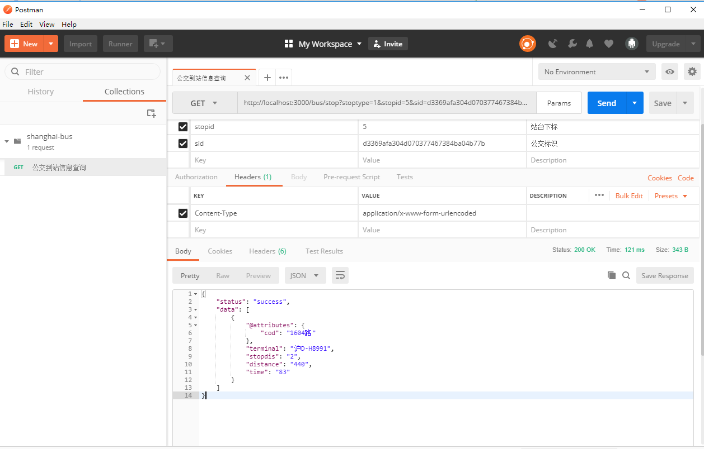

# shanghai-bus-server

> 上海公交服务端

## API

```ts

// 状态
interface Status{
  SUCCESS,
  FAIL
}

// resopnse格式
interface Response {
  status: Status,
  data: Object
}

```

### 1. 附近公交

> 查询附近500米范围内的公交信息：`/bus/list`

#### 请求方式：GET

#### 参数：

| 字段 | 类型 | 必须 | 描述 |
| ---- | ---- |--|--|
|location|`lng,lat`|是|范围中心点的经纬度|


----------------

### 2. 公交详情

> 根据公交路线查询详细信息，包括首末班车时间，车票价格，站台列表等：`/bus/detail`

#### 请求方式：GET

#### 参数：

| 字段 | 类型 | 必须 | 描述 |
| ---- | ---- |--|--|
|router|String|是|要查询的公交路线|

----------------

### 3. 公交标识（ID）

> 查询公交到站API中需要的 `sid` 字段：`/bus/id`

#### 请求方式：GET

#### 参数：

| 字段 | 类型 | 必须 | 描述 |
| ---- | ---- |--|--|
|router|String|是|要查询的公交路线|

----------------

### 4. 实时公交

> 查询公交到站的实时信息：`/bus/stop`

#### 请求方式：GET

#### 参数

| 字段 | 类型 | 必须 | 描述 |
| ---- | ---- |--|--|
|stoptype|Number|是| `0` \| `1`，公交行驶方向|
|stopid|Number|是|要查询的站台在站台列表中的下标|
|sid|String|是|`/bus/id/:router`接口中拿到的公交标识|

----------------

### API Test

+ `/bus/list`
  
+ `/bus/detail`
  
+ `/bus/id`
  
+ `/bus/stop?stoptype=1&stopid=5&sid=d3369afa304d070377467384ba04b77b`
  